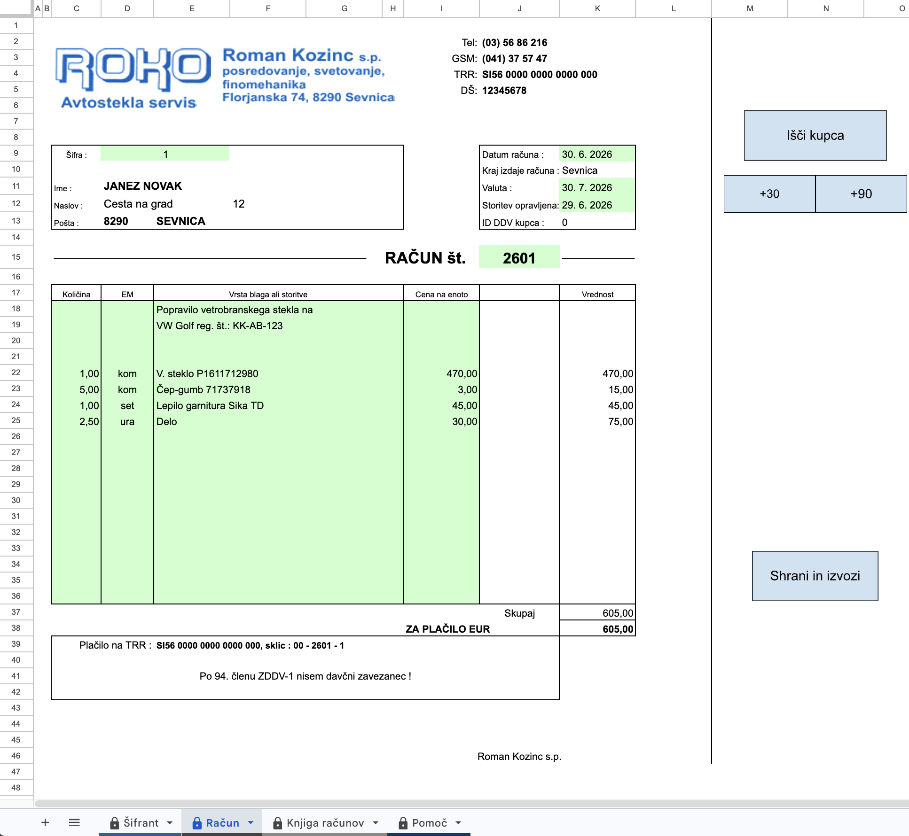
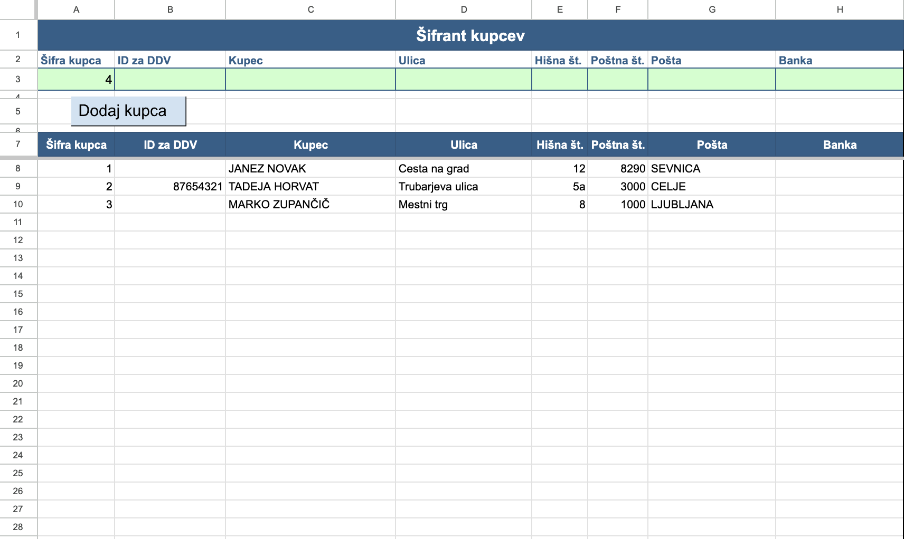
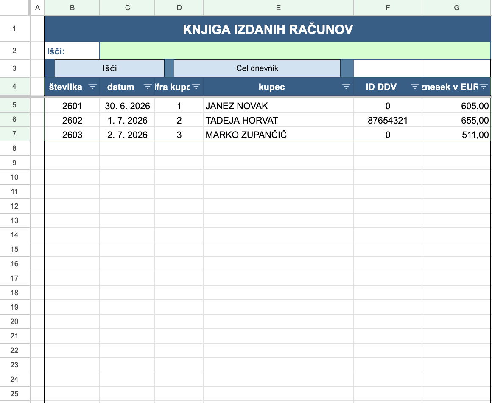
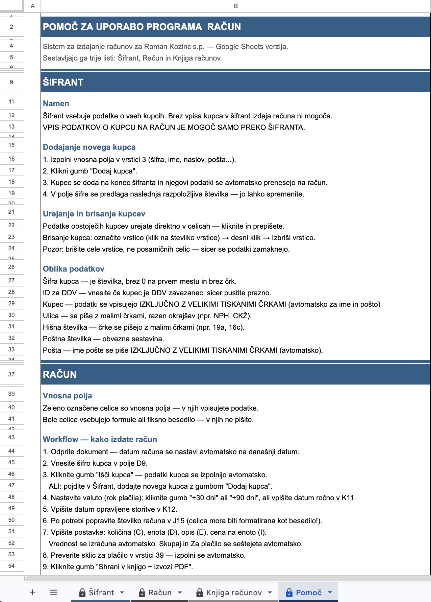

# ROKO Računi — Google Sheets

Sistem za izdajanje računov za malo podjetje, zgrajen v Google Sheets + Apps Script.

Projekt je nastal kot migracija obstoječega Excel/VBA sistema v Google Sheets z namenom poenostavitve delovnega toka in omogočanja dostopa prek Google Drive.

---

## Tehnologije

- **Google Apps Script** (JavaScript) — vsa poslovna logika
- **Google Sheets** — branje in pisanje podatkov
- **Google Drive** — shranjevanje PDF računov
- **Google Sheets PDF Export** — izvoz računa kot PDF brez zunanjih knjižnic

---

## Funkcionalnosti

- **Šifrant kupcev** — baza kupcev z vnosnim obrazcem, avtomatskim predlogom naslednje šifre in prenosom podatkov na račun
- **Izdajanje računov** — iskanje kupca po šifri, avtomatski izračun vrednosti postavk in seštevkov (formule), avtomatsko oštevilčenje v formatu LLXX (leto + zaporedna)
- **Valuta** — izračun roka plačila +30 ali +90 dni od datuma računa
- **PDF izvoz** — izvoz lista Račun kot PDF v Google Drive mapo "Računi", z avtomatskim odstranjevanjem vnosnih ozadij pred izvozom in obnovo po njem
- **Knjiga računov** — avtomatski vpis ob vsakem shranjenem računu, iskanje po vseh stolpcih, filtriranje vrstic
- **Zaznavanje podvojenih računov** — opozorilo če številka računa že obstaja v knjigi
- **Pomoč** — vgrajena dokumentacija sistema

---

## Struktura projekta

```
roko-racuni/
├── Logika.gs          # vsa Apps Script logika
├── README.md
└── screenshots/
    ├── racun.png          # list Račun z dummy podatki
    ├── sifrant.png        # list Šifrant
    ├── knjiga_racunov.png # list Knjiga računov
    └── pomoc.png          # list Pomoč
```

---

## Arhitektura

Sistem sestavljajo štirje Google Sheets listi:

| List | Namen |
|---|---|
| **Šifrant** | Baza kupcev — vnos, urejanje, iskanje |
| **Račun** | Obrazec za izdajo računa |
| **Knjiga računov** | Register vseh izdanih računov |
| **Pomoč** | Navodila za uporabo |

Vsa logika je v eni datoteki `Logika.gs` z jasno definiranimi celičnimi referencami na vrhu — ob morebitni spremembi postavitve lista je dovolj posodobiti en objekt `REF`.

---

## Screenshoti

### Račun


### Šifrant


### Knjiga računov


### Pomoč


---

## Namestitev

1. Ustvari nov Google Spreadsheet
2. Ročno zgradi liste: **Šifrant**, **Račun**, **Knjiga računov**, **Pomoč**
3. Odpri **Extensions → Apps Script**
4. Ustvari datoteko `Logika` in prilepi vsebino `Logika.gs`
5. Posodobi objekt `REF` na vrhu datoteke glede na dejanske celične reference v tvojem Spreadsheetu
6. Shrani in ponovno odpri Spreadsheet — meni **🧾 ROKO Računi** se pojavi avtomatsko
7. Gumbe poveži s funkcijami z **Insert → Drawing → Assign script**

---

## Avtor

Denis Kozinc
